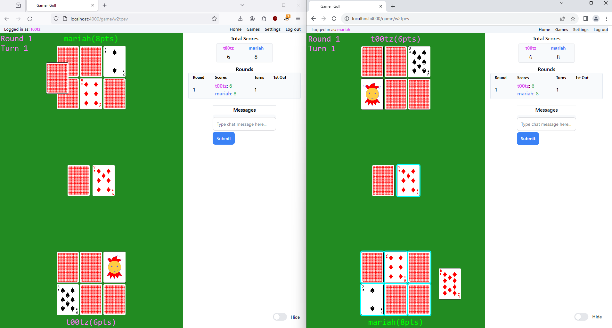

# Golf

To start your Phoenix server:

  * Run `mix setup` to install and setup dependencies
  * Start Phoenix endpoint with `mix phx.server` or inside IEx with `iex -S mix phx.server`

Now you can visit [`localhost:4000`](http://localhost:4000) from your browser.

Ready to run in production? Please [check our deployment guides](https://hexdocs.pm/phoenix/deployment.html).

## Game rules

The goal of the game is to get the lowest score possible.
At the start of a round, each player flips two cards.
After everyone has flipped two cards, the host user goes first.
Each turn, a player takes from either the deck or pile of table cards.
They can either return the card or swap it with another card in their hand.
When two cards in a column match, they are both worth zero points.
Once a player has flipped all their cards, every other player has one remaining turn.
After the final turn, every player's cards will be flipped over.

## Thanks
- Card images from www.me.uk/cards/
- Casino sounds by Kenney Vleugels (www.kenney.nl)
- Other sounds from zapsplat (www.zapsplat.com)
